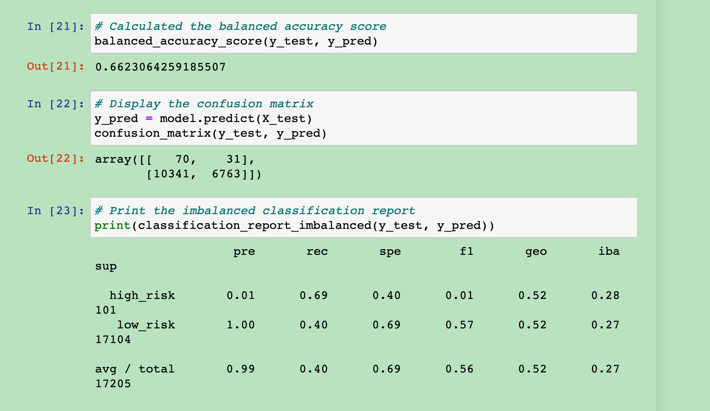
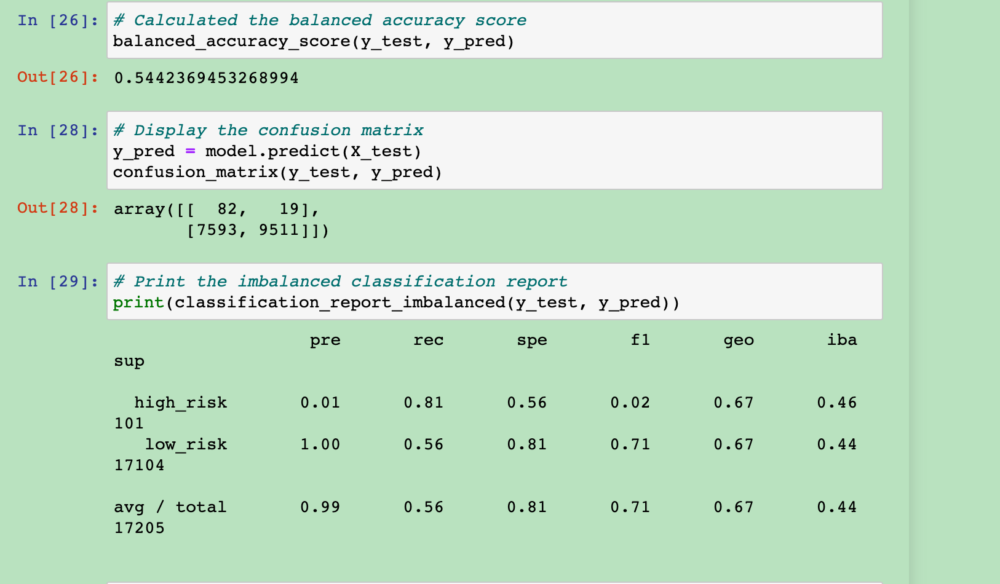
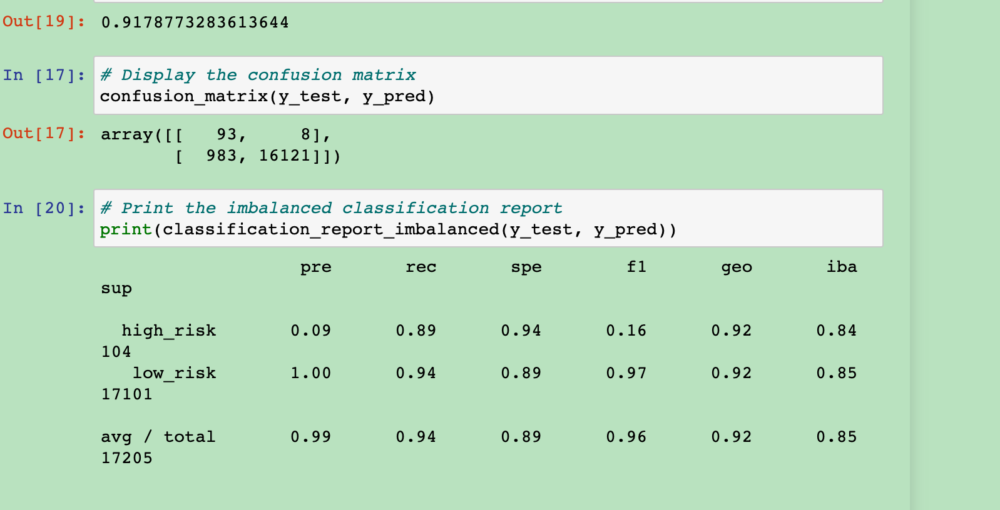

# Credit_Risk_Analysis
## Purpose
Jill asks me use 6 models to predict credit risk, and find which one is best.
## result
Naive Random Oversampling(high risk):
1. balanced accuracy is 67% 
2. the precision is 1% 
3. the recall is 74%

SMOTE Oversampling(high risk):
1. balanced accuracy is 66% 
2. the precision is 1% 
3. the recall is 63%

Undersampling(high risk):
1. balanced accuracy is 66% 
2. the precision is 1% 
3. the recall is 69%

Combination (Over and Under) Sampling(high risk):
1. balanced accuracy is 54% 
2. the precision is 1% 
3. the recall is 81%

Balanced Random Forest Classifier(average):
1. balanced accuracy is 76% 
2. the precision is 99% 
3. the recall is 86%

Easy Ensemble AdaBoost Classifier(average):
1. balanced accuracy is 92% 
2. the precision is 99% 
3. the recall is 94%

## Summary
The first four models are dtermine which model is best at predicting which loans are the highest risk. The last twoare classfy the loan are high risk or loan risk. I think the Easy Ensemble AdaBoost Classifier is the best, becasue it have the highest balanced accuracy score is 91%.

